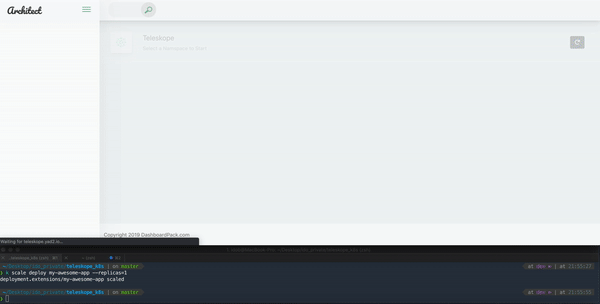

 

### Give your devs and product managers an inside view of the cluster





## Reasoning


## Getting Started

The easiset way to deploy teleskope is with helm:
```shell
git clone git@github.com:teleskopeView/teleskope_k8s.git:
cd chart
kubectl create ns teleskope
helm install --name teleskope -f example.yaml
```

Deploying teleskope with `HelmRelease`:
```
---
apiVersion: helm.fluxcd.io/v1
kind: HelmRelease
metadata:
  name: teleskope
  namespace: default
  annotations:
    fluxcd.io/automated: "true"
    fluxcd.io/tag.backend: glob:sha-*
spec:
  releaseName: teleskope
  helmVersion: v3
  chart:
    git: git@github.com:axel-springer-kugawana/y2_devopsutils.git
    path: charts/master
    ref: master
  values:
    common:
      lables:
        common: "labels"
      namespace: teleskope
    backend:
      enabled: true
      image: idobry/teleskope_backend:sha-ec71349
      command: ["./teleskope_backend", "run"]
      replicas: 1
      hpa:
        enabled: false
      env:
      - name: PORT
        value: "3000"
      service:
        port: 3000
        targetPort: 3000
      ingress:
        enabled: true
        hosts:
        - host: teleskope.io
          paths: ["/ns", "/dep", "/list", "/ws"]
    frontend:
      enabled: true
      image: efrat19/teleskope-frontend:amd64-22f456a1de2636b182e11e16781ee0f84cdddfa1
      env:
      - name: VUE_APP_WS_ENDPOINT
        value: "ws://teleskope.io/ws"
      service:
        port: 80
        targetPort: 80
      ingress:
        enabled: true
        annotations:
          kubernetes.io/ingress.class: nginx-controller-internal
        hosts:
        - host: teleskope.io
          paths: ["/"]
```

## Continued Development

Basically a roadmap.

### Coming soon


### Maybe in the future, if people want it

- user access and authentication

### Probably in the future

- select and release multiple workloads

## Built With

* [go](https://golang.org/) - Programing language
* [vue.js](https://vuejs.org/) - Frontend framework
* [docker](https://www.docker.com/) - Containerized with docker
* [helm](https://www.helm.sh/) - Packaged with helm


## Contributing

Code contributions are very welcome.

## Authors 

* [Ido Braunstain](https://github.com/idobry) - *Initial work*
* [Efrat Lavitan](https://github.com/efrat19) - *Initial work*
